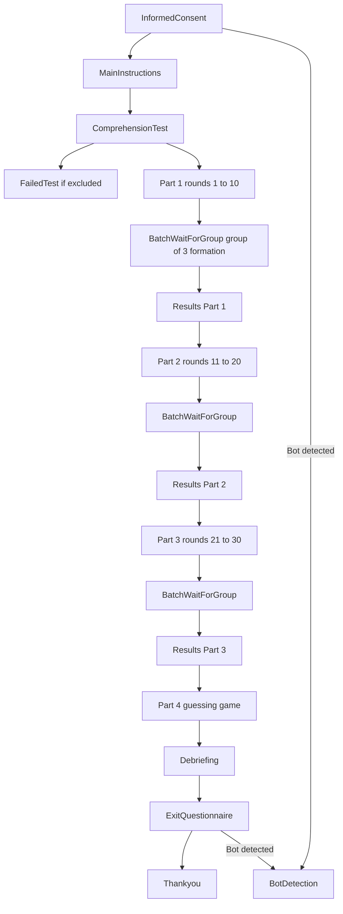
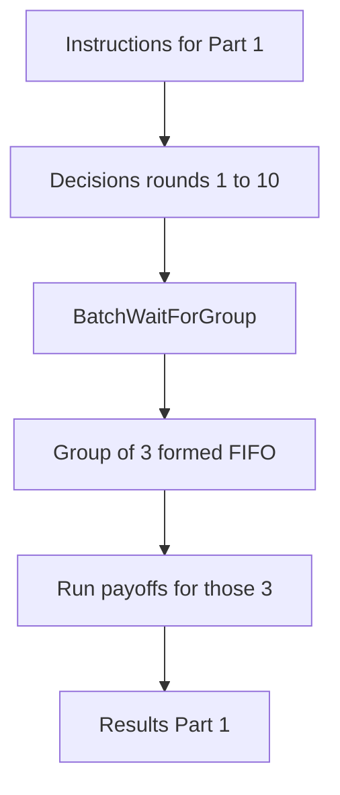
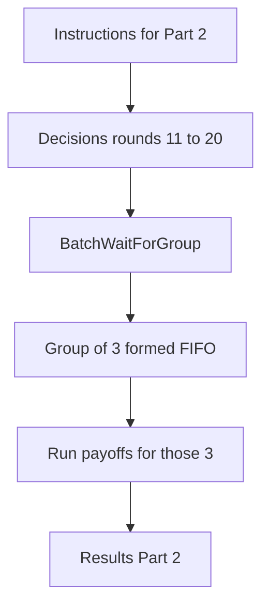
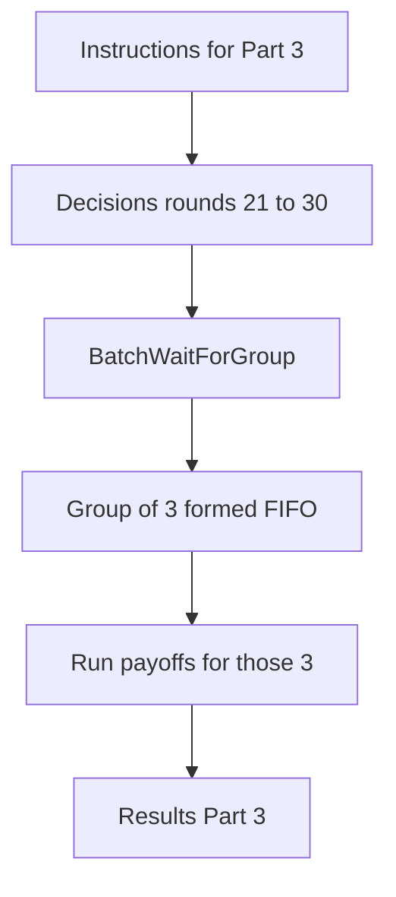
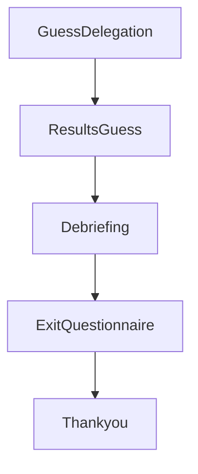

# Prisoners' Dilemma — Rule-based delegation experiment

oTree experiment for a repeated Prisoners’ Dilemma with delegation and a guessing game.

**Current core design (important):**

- Participants are **free** while making decisions.
- **Only right before Results** (end of each part) we create **logical groups of exactly 3** (FIFO).
- Opponents are assigned within that 3-person group using a **round-robin** mapping over 10 rounds.
- Payoffs are computed **only from those 3 participants’ stored choices**.

Note: the oTree admin/export may show everyone in a single oTree `group_id` (often `1`) because
we **do not rewrite oTree’s group matrix** (`players_per_group = None`). Matching does **not** use oTree’s `group_id`.
Matching uses `participant.vars["matching_group_id"]` and `session.vars["matching_group_members_part_*"]`.

## Requirements

- Python 3.10+
- [oTree](https://www.otree.org/) (install via `pip install otree` or your project’s virtualenv)

## Setup

1. Clone or download the project.
2. Create and activate a virtual environment (recommended).
3. Install dependencies (e.g. `pip install otree` if not already installed).
4. Set `OTREE_ADMIN_PASSWORD` in the environment if you use the admin interface.

## Running locally

- **Development server:**  
  `otree devserver`  
  Then open the URL shown (e.g. http://localhost:8000).

- **Create a session:**  
  Use the oTree admin (e.g. http://localhost:8000/demo) or the command line, e.g.:  
  `otree create_session prisoners_dilemma_bots 10`  
  (session config name and number of participants as needed).

## Session configs (in `settings.py`)

| Config name               | Description                          | Use case              |
|---------------------------|--------------------------------------|------------------------|
| `prisoners_dilemma_bots`  | Rule-based, 10 demo participants, bots | Automated/demo testing |
| `prisoners_dilemma_manual`| Rule-based, 10 participants, no bots | Manual testing         |
| `prisoners_dilemma_100`   | Rule-based, 100 participants, no bots| Larger manual test     |
| `manual_tests`            | Separate manual-tests app            | Other manual tests     |

## Experiment structure

- **Informed consent** → **Main instructions** → **Comprehension test**.
- **Part 1 (rounds 1–10)** → **BatchWaitForGroup (group-of-3 formation)** → **Results**
- **Part 2 (rounds 11–20)** → **BatchWaitForGroup** → **Results**
- **Part 3 (rounds 21–30)** → **BatchWaitForGroup** → **Results**
- **Part 4 (guessing game)** → **Debriefing** → **Exit questionnaire** → **Thank you**

Payoffs (in points) per round: (A,A)=70,70; (A,B)=0,100; (B,A)=100,0; (B,B)=30,30. One of Parts 1–3 is randomly selected for bonus payment; Part 4 bonus is separate. Conversion: 1 point = $0.01 (configurable in `settings.py`).

## Part-by-part flow diagrams (current)

Mermaid diagrams below follow the syntax that renders correctly in this repo’s Markdown renderer.

### Overall flow (including BotDetection and FailedTest)



### Part 1 (rounds 1–10)



### Part 2 (rounds 11–20)



### Part 3 (rounds 21–30)



### Part 4 (guessing game) and end



## Round-robin matching

Within each logical group of **N = 3**, opponents are determined by a round-robin rule over 10 rounds so that each participant faces a defined sequence of opponents and total matches = N × 10.

The round-robin mapping is implemented here:

```python
def compute_round_robin_assignments(N_players, N_rounds=10):
    ...
```

## Matching & payoff computation (current implementation)

### 1) Decisions are stored per participant per round

No matching is applied while decisions are being made.

Human decision pages:

```python
class DecisionNoDelegation(Page):
    form_model = "player"
    form_fields = ["choice"]
```

Agent programming copies 10 decisions into the 10 rounds:

```python
for i in range(1, 11):
    decision = decisions.get(i) or decisions.get(str(i))
    if decision in ("A", "B"):
        self.player.in_round(i).choice = decision
```

### 2) Groups of 3 are formed only on BatchWaitForGroup (FIFO pool)

At the end of each part, participants are added to a per-part pool:

```python
pool_key = f"results_pool_part_{current_part}"
pool.append(pid)
```

When the pool has at least 3, we pop exactly 3 (FIFO):

```python
first_ids = pool[:3]
```

We then store membership and assign per-participant matching vars:

```python
session.vars[f"matching_group_members_part_{part}_{gid}"] = [id1, id2, id3]
participant.vars["matching_group_id"] = gid
participant.vars["matching_group_position"] = 1..3
```

### 3) Opponents and payoffs use only those 3 participants

Opponent resolution uses the stored 3-member list (fast path):

```python
key = f"matching_group_members_part_{part}_{gid}"
member_ids = session.vars.get(key)
```

Payoffs are computed only for those 3 participants over the 10 rounds:

```python
pay = Constants.PD_PAYOFFS.get((c1, c2))
p.payoff = cu(pay[0]) if pay is not None else cu(0)
```

For a deep dive, see `DOC_MATCHING_FLOW_GROUPS_OF_3.md`.

## Waiting & quitting on BatchWaitForGroup

If fewer than 3 participants are available, participants wait. After they personally waited 5 minutes,
they see the option to:

- wait 5 more minutes, or
- quit to Prolific.

Quitters are removed from the pool (so they are never paired later) and are sent to the show-up link:

```python
Constants.PROLIFIC_SHOWUP_FEE_URL
```

## Data export

- **Standard oTree export:** from the admin or export URLs.
- **Custom export:** implemented in `prisoners_dilemma/models.py` (`custom_export`). Use the custom export from the oTree admin to download the app-specific CSV (round-level decisions, payoffs, guessing outcomes, bonus totals, etc.).

## Production / deployment

- `run.sh` is set up for production (e.g. Clever Cloud): it uses `DATABASE_URL` (e.g. `POSTGRESQL_ADDON_URI`) and runs `otree prodserver 9000`.
- For a local DB reset: `otree resetdb` (or `echo y | otree resetdb` non-interactively). With PostgreSQL + PostGIS, if `resetdb` fails on extension-owned tables, you may need to reset only the app schema and then run `otree migrate`.

## Project layout (main files)

- `settings.py` — Session configs, rooms, currency, admin.
- `prisoners_dilemma/` — Main app: `models.py` (constants, grouping, payoffs, custom export), `pages.py` (flow, lobby, decisions, results), `tests.py` (bot tests).
- `prisoners_dilemma/templates/prisoners_dilemma/` — HTML templates for each page.

