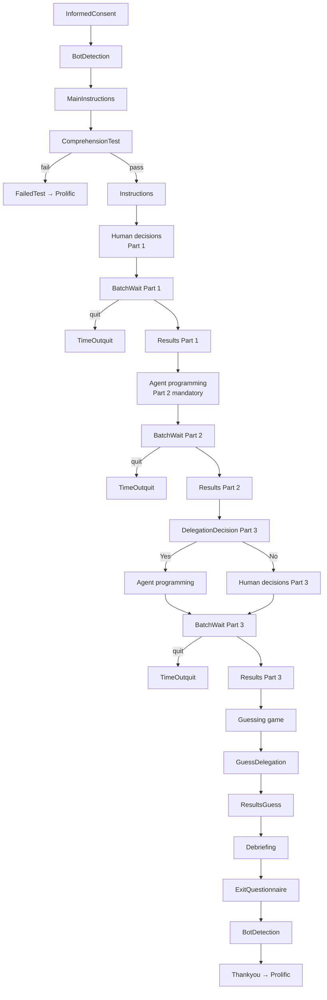
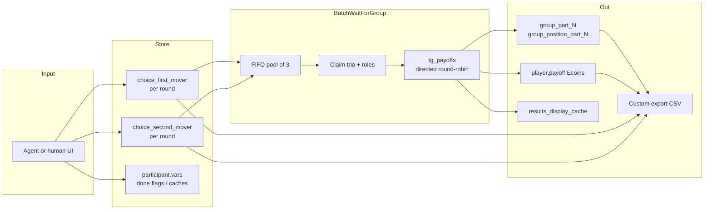
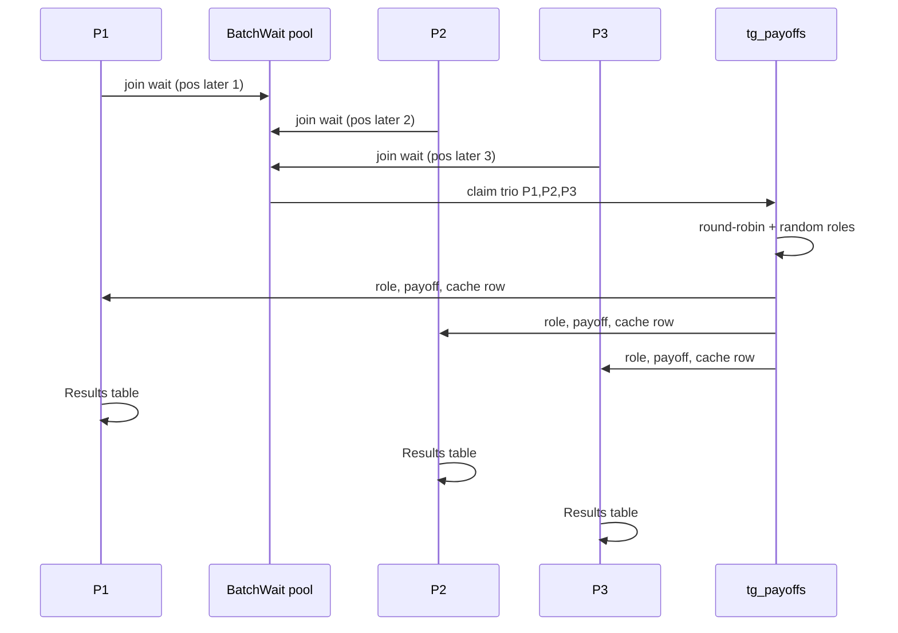

# TG_supervised_learning_delegation_2nd

Trust Game (sequential) with **supervised-learning datasets**, and **`DELEGATION_FIRST=False`**.

## Treatment

| Item | Value |
|------|--------|
| Game | Sequential Trust Game (contingent 1st/2nd mover A/B) |
| Delegation UI | Pick a dataset (different P(A)); Generate samples 10 A/B; confirm (may regenerate). |
| Order (`DELEGATION_FIRST`) | `False` — Part 1 = human, Part 2 = mandatory agent |
| Part layout | Part 1 = **human** (no agent); Part 2 = **mandatory agent**; Part 3 = **optional** delegate (same agent UI) or play yourself |
| Rounds | 30 (`num_rounds`), 10 per part |
| URL slug (`name_in_url`) | `exp_game423` |

Sibling app with reversed part order: [`TG_supervised_learning_delegation_1st`](../TG_supervised_learning_delegation_1st/).

## Payoffs (Ecoins)

| 1st mover | 2nd mover | Payoffs |
|-----------|-----------|---------|
| B | (ignored) | 30, 30 |
| A | A | 70, 70 |
| A | B | 0, 100 |

Roles are assigned at payoff time inside the matched trio. Implemented in `shared/tg_payoffs.py`.

## Session configs

| Config | Bots |
|--------|------|
| `TG_supervised_learning_delegation_2nd` | No — **use this for Prolific** |
| `TG_supervised_learning_delegation_2nd_with_bots` | Yes |

```bash
otree create_session TG_supervised_learning_delegation_2nd 60
```

Use a session size **divisible by 3**. Optional: `bot_stop_at` in Create Session → Advanced.

---

## Page flow

oTree visits the same `page_sequence` every round; most pages `is_displayed` only on the right round / part. High-level path for one participant:



### Page sequence (from `pages.py`)

1. `InformedConsent` → `BotDetection` → `MainInstructions` → `ComprehensionTest` (`FailedTest` if fail)
2. Instructions (`InstructionsNoDelegation` / `InstructionsDelegation` / `InstructionsOptional`)
3. `DelegationDecision` (Part 3 only)
4. Agent: `TgSupervisedAgentFirst` / `TgSupervisedAgentSecond`
5. Human / no-delegation decisions: `TG_V2_HUMAN_DECISIONS_FIRST_PAGES` + `…_SECOND_PAGES` — **live pages** (`TgV2HumanDecisionsFirst` / `Second`). Each role is one page that records all 10 rounds via `liveSend` (websocket), then a single form POST when the block is done. That cuts ~20 full page navigations per no-delegation part down to 2, which reduces server load, BatchWait queue pressure, and session-freeze risk under Prolific + bots.
6. End of each part: `BatchWaitForGroup` → optional `TimeOutquit` → `Results`
7. After Part 3: `InstructionsGuessingGame` → `GuessDelegation` → `ResultsGuess`
8. `Debriefing` → `ExitQuestionnaire` → `BotDetection` → `Thankyou`

Shared page classes live in `pages_classes/`; this folder mostly wraps templates + `page_sequence`.

---

## Data flow



### What gets written where

| Stage | Main fields / vars |
|-------|--------------------|
| Agent / human UI | Contingent `choice_first_mover` / `choice_second_mover` for rounds in the part; treatment-specific history (see below) |
| BatchWait success | `matching_group_id`, `matching_group_position`, then durable `group_part_N`, `group_position_part_N`, `can_proceed_to_results_part_N` |
| Payoffs | `role_assigned`, `payoff` (Ecoins); `results_display_cache` for Results/Debrief |
| Quit | `quit_to_prolific_results` → `TimeOutquit` → Prolific show-up URL |
| Export | Custom CSV via `shared/delegation_custom_export.py` (blanks / `"quit"` when unknown — no invented zeros) |

### Agent programming (this treatment)

Pages: `TgSupervisedAgentFirst` / `TgSupervisedAgentSecond`.

Pick a dataset (different P(A)); Generate samples 10 A/B; confirm (may regenerate).

Saved / notable fields:

- `supervised_history` — datasets shown + Generate `attempts[]`
- `supervised_dataset`, `supervised_mean`, `supervised_last_generated_csv`
- Contingent choices copied into `choice_first_mover` / `choice_second_mover`

---

## Worked example: P1, P2, P3 in one trio

In this app Part 1 is human and Part 2 is agent-programmed. The matching / payoff logic is identical for every TG treatment; only **how** the A/B plans are produced differs (supervised-learning datasets).

### 1. Three people finish the part and wait

| Label | `id_in_session` | Arrives at BatchWait |
|-------|-----------------|----------------------|
| **P1** | 1 | first |
| **P2** | 2 | second |
| **P3** | 3 | third |

`BatchWaitForGroup` FIFO-claims the first three in the pool as **one matching group** and assigns trio positions:

| Player | `matching_group_position` / `GroupPositionPart*` |
|--------|---------------------------------------------------|
| P1 | 1 |
| P2 | 2 |
| P3 | 3 |

Durable after success: `group_part_N` (batch id) + `group_position_part_N`. If someone cannot wait long enough they may **quit** → Prolific show-up code; export marks `PartChosenBonus=quit` (earnings cells are `"quit"`, not `0.0`).

### 2. Directed round-robin opponents (N = 3)

Within the trio, each round each player has **one directed opponent** (not a mutual simultaneous pair write). Example for rounds 1–2:

| Round | P1 faces | P2 faces | P3 faces |
|-------|----------|----------|----------|
| 1 | P3 | P1 | P2 |
| 2 | P2 | P3 | P1 |

(Implemented by `compute_round_robin_assignments` in this app’s `models.py`.)

### 3. Contingent choices (what each person already submitted)

Before matching, each player stored **both** contingent moves for every round:

- `choice_first_mover` — what I would do as 1st mover  
- `choice_second_mover` — what I would do as 2nd mover  

**Example plans for round 1 only:**

| Player | If 1st mover | If 2nd mover |
|--------|--------------|--------------|
| P1 | A | B |
| P2 | B | A |
| P3 | A | A |

### 4. Role assignment + payoff for one directed match

Focus on **P1 → P3 in round 1**. At payoff time the code randomly assigns who is 1st vs 2nd **for that directed edge**, then looks up the contingency that matches the assigned role.

Suppose the RNG assigns:

- P1 = **first** mover → uses P1’s `choice_first_mover` = **A**  
- P3 = **second** mover → uses P3’s `choice_second_mover` = **A**  

Trust-game Ecoins (`shared/tg_payoffs.py`):

| 1st | 2nd | Payoffs (1st, 2nd) |
|-----|-----|---------------------|
| B | (ignored) | 30, 30 |
| A | A | **70, 70** |
| A | B | 0, 100 |

So this match: **P1 earns 70**, **P3 earns 70** on P1’s directed row (opponent column on Results shows the other player’s effective move). Other directed edges (P2→P1, P3→P2) are computed the same way with their own random roles.



### 5. What each person sees on Results

For each of the 10 rounds of the part: own effective choice, opponent’s effective choice, Ecoins.  
If `role_assigned` is missing, Ecoins stay **blank** in the custom export (no invented `0` from framework defaults).

### 6. Later parts

Parts 2 and 3 each form a **new** trio from whoever is waiting (FIFO again). Positions are stored separately as `GroupPart2` / `GroupPart3`. After Part 3, the guessing game asks whether each Part‑3 opponent delegated; unknown truth → `guess_payoff` left null (not `0`).


---


## Redis

oTree uses Redis for **channels / wait-page wakeups** across workers (BatchWait and live pages). Experiment data still lives in **Postgres**; Redis is not a substitute for the DB.

| Item | Detail |
|------|--------|
| Clever | Create a Redis addon and **link it to the Python oTree app** (not Postgres) |
| Env | oTree expects `REDIS_URL`. Clever may inject `REDIS_HOST` / `REDIS_PORT` / `REDIS_PASSWORD` (or `REDIS_CLI_URL`); `run.sh` maps those into `REDIS_URL` when needed |
| Topology | Prefer **one** app instance + Redis; scaling out web instances for the same session usually worsens Session-row contention |
| Check | BatchWait logs once per session whether Redis is linked (see `pages_classes/BatchWaitForGroup.py`) |

Without Redis, multi-worker wait wakeups are less reliable. Full Clever layout: [docs/CLEVER_OTREE_SCALING.md](../docs/CLEVER_OTREE_SCALING.md).

---

## Layout in this folder

| Path | Role |
|------|------|
| `models.py` | Constants, Player fields, round-robin + export hooks |
| `pages.py` | Thin wrappers + `page_sequence` |
| `tests.py` | Browser-bot tests |
| `templates/TG_supervised_learning_delegation_2nd/` | App-specific HTML |

Shared logic: `pages_classes/`, `shared/tg_payoffs.py`, `shared/matching_batch.py`, `pages_classes/BatchWaitForGroup.py`.
